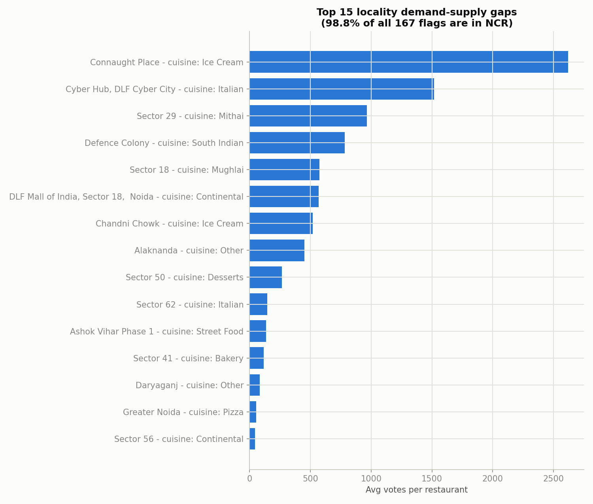
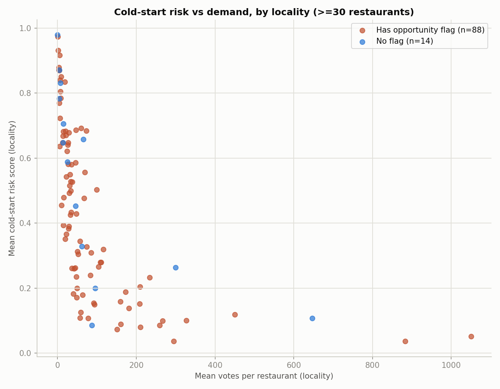
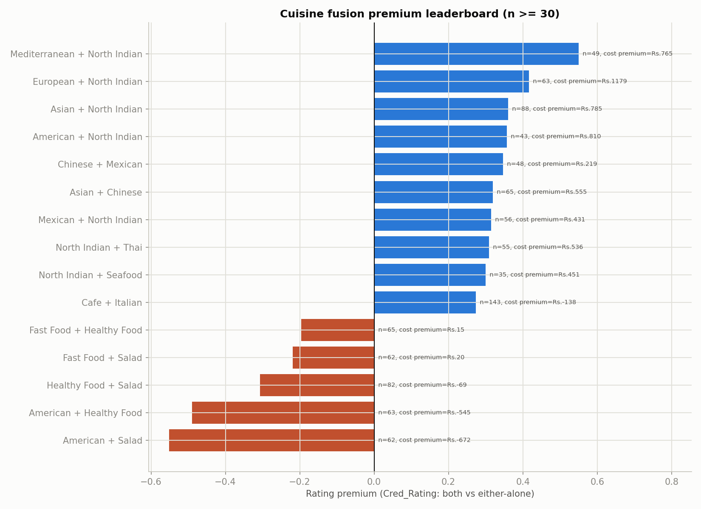
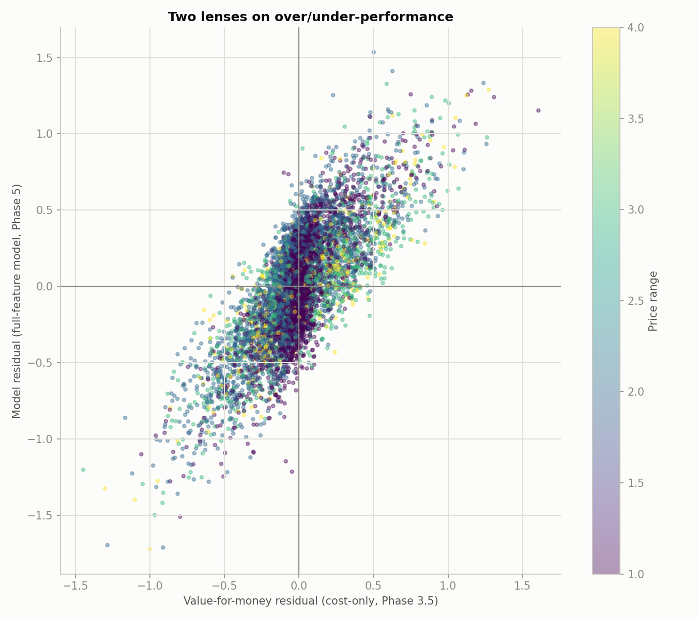

# Zomato India Restaurant Analysis — Business Report

## Executive summary

This report synthesizes a full data analysis of **8,643 India-listed restaurants** on Zomato (91.95% of them in the Delhi NCR region), covering data cleaning, exploratory analysis, statistical testing, five derived business metrics, and two predictive models. It closes the project with business-facing takeaways, five summary charts, and a stated set of limitations. All prices are in plain Indian Rupees (INR) — no currency conversion was applied anywhere in this analysis (see "How to read this report" below).

This document is a **derived companion** to `Insights_Reporting.ipynb`, the notebook that actually produced every number and chart cited here. It contains no code — read it standalone, or open the notebook for full methodology.

## How to read this report

- **India-only scope.** The original dataset spans 12 currencies across 15 countries; comparing costs across them without a conversion factor would be invalid, so this entire analysis restricts to India, where cost is plain, already-in-Rupees, and comparable.
- **"Unrated" is not "rated zero."** 24.7% of restaurants have never received a single rating. Every rating statistic in this report excludes them, unless a section is explicitly about the unrated group itself (the cold-start problem, below).
- **NCR-heavy sample.** 91.95% of restaurants are in the Delhi NCR region (New Delhi, Gurgaon, Noida, Faridabad, Ghaziabad). Findings about "outside NCR" carry an explicit caveat wherever they appear — that slice of the data is small and was collected differently.
- Every number below traces back to a specific file the notebook produced, named in parentheses — nothing here is asserted without a source.

## Key business recommendations

### 1. Target NCR localities that are both demand-supply flagged and cold-start-risk-heavy

430 restaurants sit at or above the 90th-percentile cold-start risk score (0.890) **and** are located in one of 167 flagged locality/cuisine or locality/price-tier demand-supply gaps (`business_action_list.csv`). 99.7% of this combined list is in NCR.

**Action:** prioritize onboarding and visibility work — photo completeness, menu upload, review solicitation — for these 430 restaurants before any non-NCR expansion effort.

**Caveat:** non-NCR localities almost never appear here because they rarely reach the minimum 30-restaurant sample needed to flag a gap reliably. Their absence is a detection limit, not proof there's no opportunity outside NCR.

Cold-start risk falls sharply as a locality's typical demand (mean votes per restaurant) rises — and that pattern holds equally whether or not the locality carries a demand-supply flag. The two signals are largely independent, which is exactly why recommendation 1 needed a restaurant-level cross-reference rather than relying on locality flags alone.

### 2. Use credibility-weighted ratings, not raw star ratings, for any leaderboard or "featured restaurant" logic

A handful of restaurants with fewer than 10 votes carry a raw 4.9 rating that shrinks materially once vote count is accounted for (`credibility_weighted_ratings.csv`).

**Action:** swap the ranking input in any internal leaderboard, incentive program, or "featured restaurants" feature to the credibility-weighted rating (`Cred_Rating`) instead of the raw star rating.

**Caveat:** the shrinkage strength is a judgment call, but the resulting re-ranking was tested and found stable across a reasonable range of that choice.

### 3. Build cuisine-fusion menu guidance around proven pairings, not "more cuisines" in general

56 of 83 tested cuisine pairings show a genuine rating premium over serving either cuisine alone (`cuisine_pair_premium.csv`). The strongest cluster pairs a global or regional cuisine with North Indian food (+0.30 to +0.55 rating points); Cafe + Italian stands out as rated both higher *and* cheaper than either cuisine alone.

**Action:** when advising restaurants on menu expansion, recommend specific proven pairings rather than generic "add more cuisines" advice.

**Caveat:** this is an association, not proof that the pairing itself causes the premium — a restaurant with an already-strong kitchen may simply execute fusion menus more successfully.

Every positive-premium pairing above involves North Indian food paired with another cuisine (or, for Cafe + Italian, stands on its own with the largest sample and a lower price). Every negative pairing involves Healthy Food, Salad, Fast Food, or American — a consistently under-performing cluster, not scattered noise.

### 4. Don't advise restaurants that table booking or online delivery will raise their rating

Table booking's apparent rating benefit reverses once price tier and region are held fixed (a statistical pattern called Simpson's paradox); online delivery's apparent link to rating was found to be 89% an artifact of how unrated restaurants were originally counted (`phase4_test_results.csv`).

**Action:** treat both features as business decisions justified on their own merits (revenue, customer reach) — not as rating-improvement tactics.

**Caveat:** this finding is specifically about their effect on *rating* — they may still be worth offering for other reasons.

### 5. Adjust competitive-density guidance by price tier — there's no single "avoid crowded areas" rule

The relationship between how many nearby competitors a restaurant has and its rating is not a straight line: restaurants with zero competitors within 1km rate highest overall, but that reverses at the two most expensive price tiers, where denser areas actually rate higher — and no restaurant with zero competitors exists at the top price tier at all (`competition_density.csv`).

**Action:** budget-tier restaurants may genuinely benefit from a quieter location; premium-tier restaurants should co-locate in established commercial hubs rather than seek isolation.

**Caveat:** this is confounded with the fact that dense commercial hubs are also higher-cost areas — density is associated with, not proven to independently cause, the rating pattern.

### 6. Route disagreements between the two "value" lenses into a manual review queue

Two independent estimates of whether a restaurant over- or under-delivers for its price — one using cost alone, one using the full predictive model — agree strongly (a correlation of 0.784) but disagree on direction for about **1 in 4 restaurants**.

**Action:** flag that quarter of restaurants for human review rather than trusting either single number — that's exactly where the two ways of measuring "value" genuinely diverge.

**Caveat:** disagreement here is expected and informative, not a flaw in either measurement — they are deliberately different lenses on the same question.

### 7. Pair the rating-prediction model and the cold-start model for different jobs — don't expect either to do the other's

The best rating-prediction model built only from levers an owner actually controls (cost, price tier, cuisine, location, etc. — deliberately excluding vote count) explains about 40% of the variation in ratings. The cold-start model, which predicts whether a restaurant will ever get rated at all, is considerably stronger within NCR (roughly 89 out of 100 correctly ranked) — but the two answer different questions.

**Action:** use the rating model only for directional guidance ("which levers move the needle a little"), and the cold-start model for visibility/onboarding triage ("which restaurants risk staying invisible"). Neither should be read as a precise numeric forecast.

**Caveat:** the ~40% ceiling on the rating model is the honest finding from this dataset, not a shortfall to be engineered away with more of the same kind of data.

### 8. Use the full locality/cuisine breakdown, not just the 167 already-flagged gaps, as a second-tier opportunity list

The 167 flagged gaps are only the cells that clear a strict statistical bar within their own locality. Many more combinations sit just below that bar in the full breakdown (`locality_cuisine_crosstab.csv`, 1,195 rows).

**Action:** once the strict list of 167 is exhausted, use the fuller table as a set of leads worth investigating manually.

**Caveat:** cells below the strict threshold are, by construction, less statistically distinctive — treat them as leads, not established gaps.

## Limitations

| Limitation | Concrete numbers | Why it matters |
|---|---|---|
| Geographic concentration | 91.95% of restaurants are in NCR; roughly 42% of the raw "outside NCR rates higher" gap is explained by which restaurants happened to get more votes, not location itself | Any claim that restaurants outside NCR are simply "better" describes a small, curated, popular slice — not a fair comparison |
| Unrated restaurants & the cold-start blind spot | 24.7% of restaurants have never been rated; 100% of those unrated restaurants are in NCR, so outside NCR the cold-start problem doesn't exist in this data at all | The ~89% accuracy figure for the cold-start model must always be read as an NCR-only number, never applied to the dataset as a whole |
| Votes and ratings were measured at the same moment | A model that's allowed to use vote count explains 54% of rating variation — almost entirely from vote count alone | Vote count and rating can't be untangled into cause and effect here; a model using votes describes the data, it doesn't predict from levers a business can actually pull |
| No time dimension | This is a single snapshot, not a tracked history | None of these findings can distinguish a trend from a one-time level, and no recommendation's effect over time can be validated from this data alone |
| No true currency conversion | The original dataset spans 12 currencies; India-only scope was chosen specifically to avoid needing a conversion factor | Nothing in this report generalizes to other countries in the original dataset |
| A ceiling of about 40% on what the rating model can explain | Best controllable-lever model: 40.5% of rating variation explained overall, 32.4% within NCR, 13.6% outside NCR (on a very small comparison sample) | Sets the honest expectation for any tool built on this analysis — a modest result here is the finding itself, not a defect |

## What's next

An optional, separate extension using a Delhi-specific photo/URL dataset (`file1–5.json`, ~2,358 restaurants) was scoped but never started, and is not part of this report.

---

*This report was generated from `Insights_Reporting.ipynb`. For full methodology, code, and every intermediate number, see that notebook and the companion `Output/` files it produced.*
